# Projet d'analyse de données: les blocs Minecraft

Réalisation:

- Raphaël Bardini
- Titouan Rhétoré
- Mathieu Le Bout

<!-- omit in toc -->
## Introduction

Ce projet vise à explorer et analyser un jeu de données issu du célèbre jeu vidéo Minecraft, en appliquant diverses techniques d'analyse de données. Nous nous concentrons sur les caractéristiques des blocs présents dans le jeu, en utilisant des méthodes statistiques et de machine learning pour extraire des informations pertinentes.

<!-- omit in toc -->
## Sommaire

- [Code source](#code-source)
- [Présentation du jeu de données "Blocks"](#présentation-du-jeu-de-données-blocks)
  - [Origine](#origine)
  - [Variables](#variables)
  - [Caractéristiques](#caractéristiques)
  - [Nettoyage](#nettoyage)
  - [Conversion en CSV: `blocklist_clean.json` → `blocklist_clean.csv`](#conversion-en-csv-blocklist_cleanjson--blocklist_cleancsv)
- [Analyse en composante principale](#analyse-en-composante-principale)
  - [Interprétations (charges/corrélations)](#interprétations-chargescorrélations)
- [Analyse factorielle des correspondances](#analyse-factorielle-des-correspondances)
  - [Cartes factorielles \& rotations](#cartes-factorielles--rotations)
- [Analyse en composants multiples](#analyse-en-composants-multiples)
  - [Lecture synthétique des axes](#lecture-synthétique-des-axes)
- [Clustering K-moyennes](#clustering-k-moyennes)
  - [Choix de $K$](#choix-de-k)
  - [Représentation](#représentation)
  - [Liste](#liste)
- [Clustering hiérarchique](#clustering-hiérarchique)
- [Conclusion](#conclusion)
- [Annexe 1: Liste clusters](#annexe-1-liste-clusters)
  - [Cluster 1 (29 items, 2.69%): Énergie et illumination](#cluster-1-29-items-269-énergie-et-illumination)
  - [Cluster 2 (375 items, 34.75%): Matériaux de base et blocs pleins](#cluster-2-375-items-3475-matériaux-de-base-et-blocs-pleins)
  - [Cluster 3 (118 items, 10.94%): Transparence, clôtures et limites](#cluster-3-118-items-1094-transparence-clôtures-et-limites)
  - [Cluster 4 (120 items, 11.12%): Formes dérivées : escaliers et dalles](#cluster-4-120-items-1112-formes-dérivées--escaliers-et-dalles)
  - [Cluster 5 (235 items, 21.78%): Objets interactifs et décorations fines](#cluster-5-235-items-2178-objets-interactifs-et-décorations-fines)
  - [Cluster 6 (11 items, 1.02%): Blocs de contrôle et techniques réservées aux opérateurs](#cluster-6-11-items-102-blocs-de-contrôle-et-techniques-réservées-aux-opérateurs)
  - [Cluster 7 (191 items, 17.70%): Végétation, signaux et entités vivantes](#cluster-7-191-items-1770-végétation-signaux-et-entités-vivantes)

## Code source

Le code source de ce compte-rendu et des graphiques peut être trouvé sur le dépôt GitHub [5cover/r5.c.08-datanalyse](https://github.com/5cover/r5.c.08-datanalyse).

## Présentation du jeu de données "Blocks"

Liste des blocs dans le jeu-vidéo Minecraft.

### Origine

Source: [Minecraft Block Property Encyclopedia](https://joakimthorsen.github.io/MCPropertyEncyclopedia), consulté le 1er octobre 2025.

Format: JSON

Nombre de lignes: 1079

### Variables

- QN: qualitative nominale
- QO: qualitative ordinale
- TC: quantitative continue
- TD: quantitative discrete

variable|type|signification
-|-|-
blast_resistance|TD|blast resistance
block|QN|block name (string)
conductive|QO: No, Maybe, Yes|does it conduct redstone?
full_cube|QO: No, Maybe, yes
height_external|TD $[0;24]$|
luminance|TD $[0;15]$|light emission level
movable|QO: No, Breaks, Maybe, Yes|can this block be moved
number_of_variants|TD|
spawnable|QN: No, Fire-Immune Mobs Only, Ocelots and Parrots Only, Polar Bear Only, Maybe, Yes
volume|TD|Numbers of voxels (1/16 block³) the block occupies in average
width_external|TD|Average voxel width (1/16 blocks)
height_external|TD|Average voxel height (1/16 blocks)

### Caractéristiques

- Valeur manquantes : `No Translation Key: *` &rarr; remplacées par l'ID du block
- Variance élevée : la standardisation sera vitale
- Valeurs très discrètes : beaucoup de superpositions

### Nettoyage

`blocklist.json` &rarr; `blocklist_clean.json`

Script: [src/minecraft/blocks/clean_json.py](https://github.com/5cover/r5.c.08-datanalyse/tree/main/src/minecraft/blocks/clean_json.py)

1. **Aplatissement des variantes** :
    - Chaque bloc est décomposé en plusieurs lignes, une pour chaque variante.
    - Si un bloc n'a pas de variantes, il est traité comme une seule ligne.
    - Un champ `number_of_variants` est ajouté pour indiquer le nombre total de variantes du bloc d'origine.

2. **Extraction des dimensions et calcul du volume** :
    - Pour `height_external` et `width_external`, le script recherche une valeur numérique spécifique à la variante.
    - En l'absence de valeur spécifique, il calcule la moyenne de toutes les valeurs numériques trouvées.
    - Les dimensions sont converties en entiers (0 par défaut).
    - Un champ `volume` est calculé en utilisant la formule : `width * width * height`.

3. **Normalisation des champs numériques** :
    - Pour `blast_resistance` et `luminance`, le script extrait une valeur flottante, en priorisant celle de la variante.
    - Si aucune valeur spécifique à la variante n'est trouvée, la moyenne des valeurs disponibles est utilisée.

4. **Standardisation des champs qualitatifs** :
    - Les champs `conductive`, `full_cube`, et `spawnable` sont normalisés en "Yes", "No", ou "Maybe".
    - "Maybe" est assigné si des valeurs contradictoires ("Yes" et "No") sont présentes dans les données brutes du bloc.
    - Le champ `movable` est également normalisé en "Yes", "No", "Maybe", mais conserve sa valeur textuelle (ex: "Breaks") si elle ne correspond pas.

5. **Sauvegarde** :
    - La liste des blocs nettoyés est sauvegardée dans `blocklist_clean.json` avec une structure claire et formatée.

### Conversion en CSV: `blocklist_clean.json` &rarr; `blocklist_clean.csv`

Script: [src/minecraft/blocks/json_to_csv.py](https://github.com/5cover/r5.c.08-datanalyse/tree/main/src/minecraft/blocks/json_to_csv.py)

```py
with open("./datasets/minecraft/blocks/blocklist_clean.json", encoding="utf-8") as inputfile:
    df = pd.read_json(inputfile)
df.to_csv("./datasets/minecraft/blocks/blocklist_clean.csv", sep=";", encoding="utf-8", index=False)
```

Note: certaines techniques utilise le format JSON, d'autres le format CSV.

## Analyse en composante principale

Script: [src/minecraft/acp/acp_blocks.py](https://github.com/5cover/r5.c.08-datanalyse/tree/main/src/minecraft/acp/acp_blocks.py)

**Méthode.** Nous appliquons une ACP sur 6 variables quantitatives (`height_external`, `width_external`, `number_of_variants`, `volume`, `blast_resistance`, `luminance`). Les données sont **centrées-réduites** (z-score), puis nous ajustons une PCA et exportons : valeurs propres, barchart de variance, cercle des corrélations, biplots individus/variables.

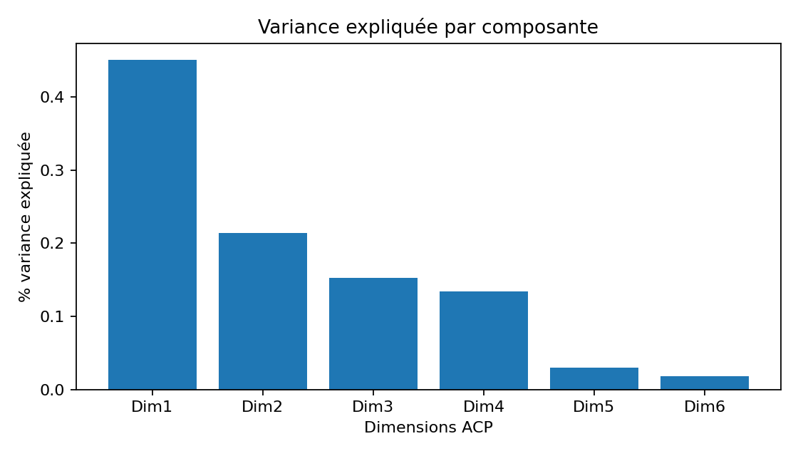

**Choix du nombre de composantes.** Les deux premières dimensions cumulent **66,46 %** de variance expliquée et les trois premières **81,75 %**. Nous retenons **2D** pour les graphiques (lisibilité) et **3D** pour la lecture globale.

| Dimension | Valeur propre | % variance expliquée | % cumulée |
|---|---:|---:|---:|
| Dim1 | 2,705 | **45,09 %** | 45,09 % |
| Dim2 | 1,282 | **21,37 %** | 66,46 % |
| Dim3 | 0,917 | 15,29 % | 81,75 % |
| Dim4 | 0,808 | 13,46 % | 95,21 % |
| Dim5 | 0,178 | 2,97 % | 98,18 % |
| Dim6 | 0,109 | 1,82 % | 100,00 % |

### Interprétations (charges/corrélations)

- **Dim1 (≈ 45 %) — Axe « taille/pleineur »** : fortes charges positives pour `volume` (≈ 0,58), `height_external` (≈ 0,58) et `width_external` (≈ 0,57). Les variables de gabarit sont corrélées entre elles et tirent les blocs vers la droite du plan.  
- **Dim2 (≈ 21 %) — Axe « résistance & lumière vs diversité »** : `luminance` (≈ 0,62) et `blast_resistance` (≈ 0,49) sont positives alors que `number_of_variants` est négative (≈ −0,61). On observe donc un **trade-off** : blocs lumineux/résistants ↔ moins de variantes, et inversement.

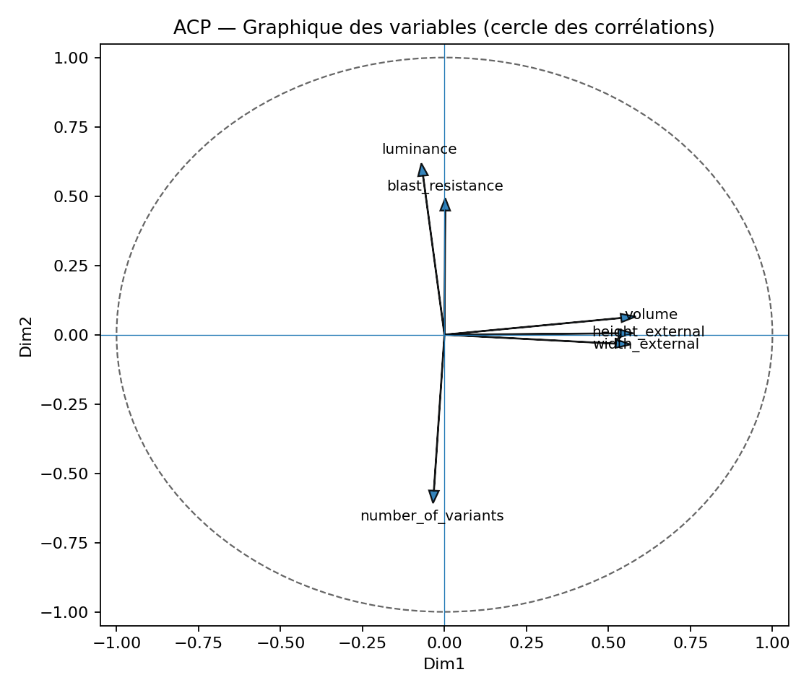

**Projection des individus.** Sur le plan (Dim1, Dim2), les blocs **volumineux/pleins** se projettent à droite (Dim1 > 0). En colorant par `conductive`, les blocs **conducteurs** se concentrent plutôt côté **Dim1 positif**, alors que les **non-conducteurs** sont plus dispersés vers Dim1 négatif.

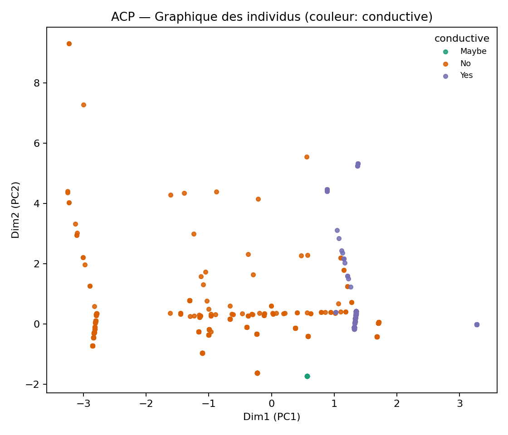

**Biplot combiné.** Le biplot (points + flèches) confirme : le nuage s’étire surtout selon **Dim1** ; `volume`, `height_external` et `width_external` sont alignées (corrélées), tandis que `number_of_variants` pointe à l’opposé de `luminance`/`blast_resistance` sur **Dim2**.

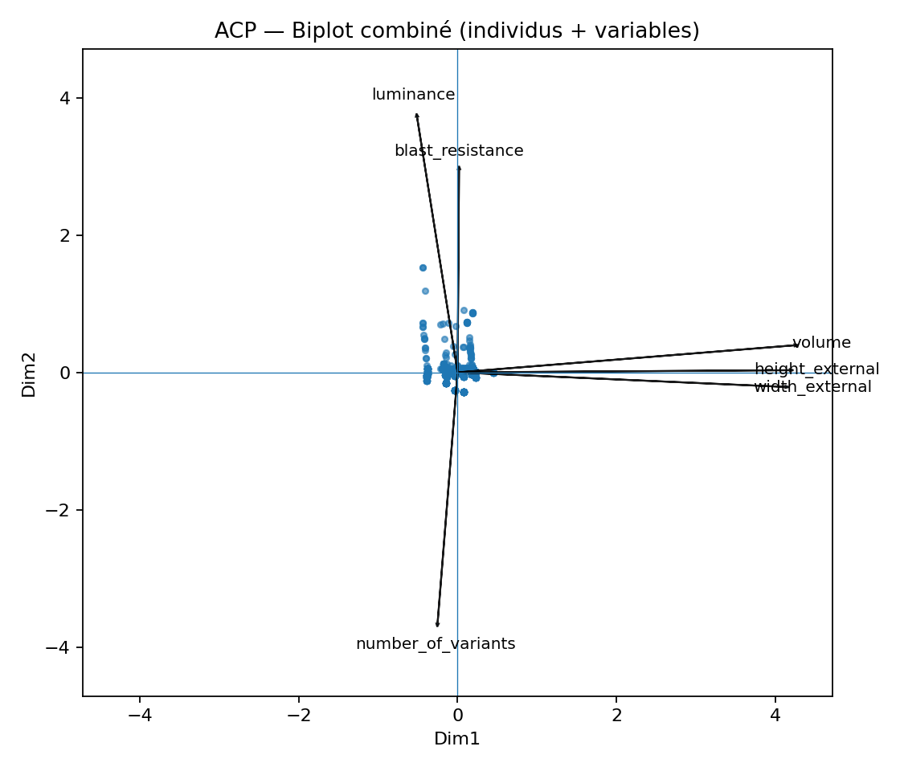

**À retenir.** (i) la **morphologie** des blocs (hauteur/largeur/volume) explique l’essentiel de la variabilité, (ii) **résistance/luminosité** et **nombre de variantes** évoluent en sens opposé sur Dim2, (iii) ces axes structurent des sous-groupes utiles pour la suite (ex. clustering).

## Analyse factorielle des correspondances

Script: [src/minecraft/afc/afc_blocks.py](https://github.com/5cover/r5.c.08-datanalyse/tree/main/src/minecraft/afc/afc_blocks.py)

**Méthode.** Nous réalisons une **AFC** sur la table de contingence entre `conductive` (lignes) et `full_cube` (colonnes). Le script (`afc_blocks.py`) :

1. construit la table de contingence
2. effectue un **test du χ²** d’indépendance
3. **standardise** les colonnes (z-score)
4. extrait les **valeurs propres** et **facteurs** (critère de Kaiser)
5. puis génère une **carte factorielle** sans rotation et avec **Varimax**/**Quartimax**. Tout est exécuté en **headless** et exporté (table, scree plot, cartes).

**Sélection des variables et pertinence.** La sélection automatique retient `x="conductive"` et `y="full_cube"` avec **p-value = 0** (χ²), ce qui rejette l’indépendance : **l’AFC est pertinente**.
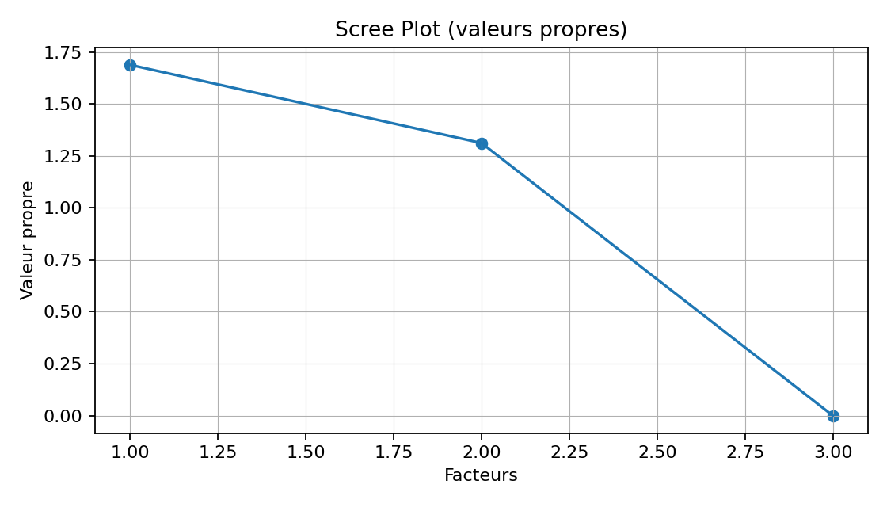

**Nombre de facteurs.** Avec trois modalités côté colonnes, au plus **2 facteurs** sont interprétables. Le **scree plot** montre deux valeurs propres ≥ 1 (Kaiser) et une troisième ≈ 0 ; on **retient 2 dimensions**, suffisantes pour résumer l’association `conductive` × `full_cube`.

### Cartes factorielles & rotations

- *Sans rotation* : on observe des **proximité́s lignes↔colonnes homogènes** :  
  `Yes` (conductive) est proche de `Yes` (full_cube) ; `No` (conductive) est proche de `No` (full_cube) ; `Maybe` s’aligne avec `Maybe`. Ces voisinages traduisent une **corrélation positive forte** entre modalités de même nom.

  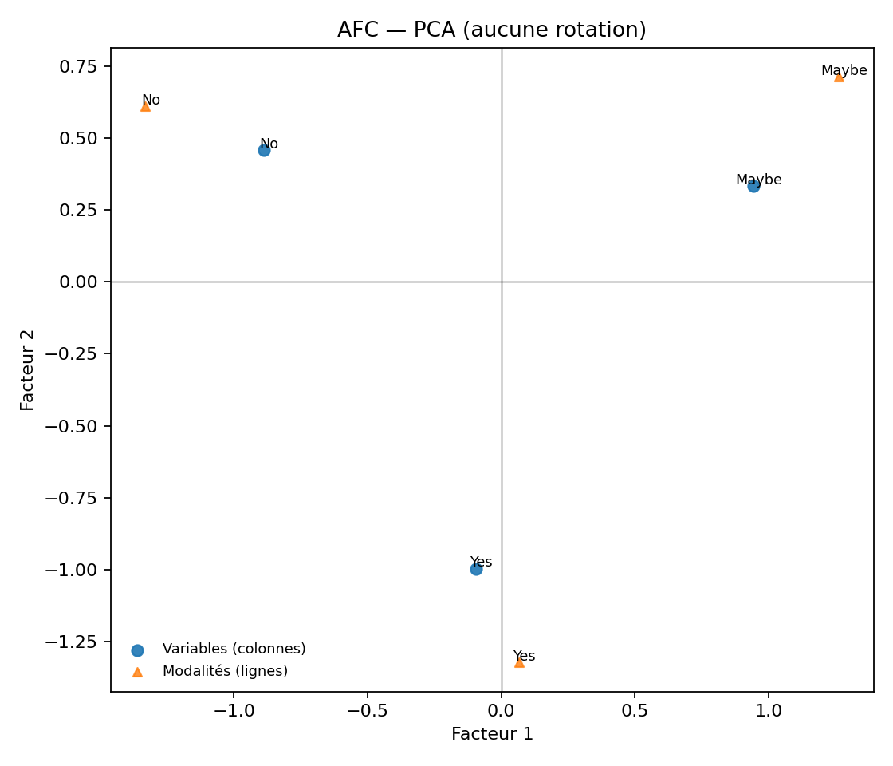
- *Varimax / Quartimax* : les rotations **simplifient la lecture** (charges concentrées par facteur) sans changer l’histoire : l’axe 1 ordonne plutôt **No ↔ Maybe**, l’axe 2 oppose **Yes** aux autres, et les duos (ligne/colonne) restent groupés.
  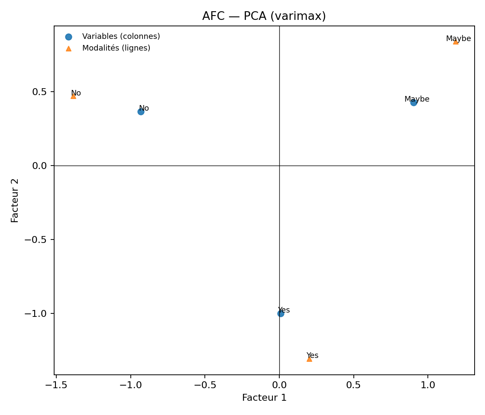
  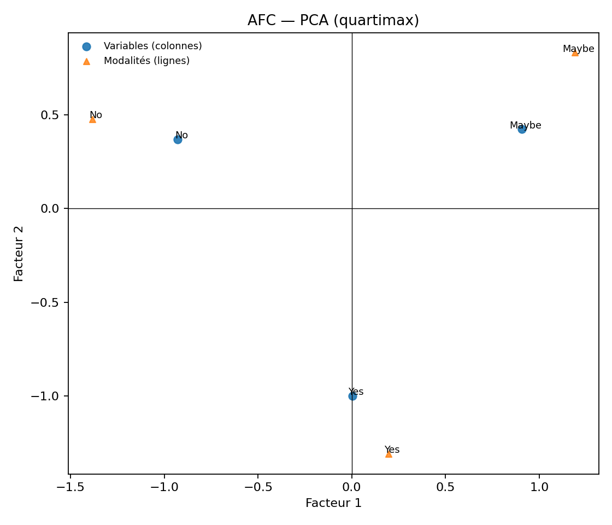

**Interprétation substantielle (à partir de la table de contingence).** Les blocs **conducteurs** sont **très majoritairement pleins** (`full_cube=Yes`), tandis que les **non-conducteurs** sont surtout **non pleins** (`full_cube=No`) ; `Maybe` forme un petit groupe intermédiaire. Cette structure explique l’alignement des modalités homonymes sur la carte.

**À retenir.** (i) Le test du χ² confirme une **dépendance nette** entre `conductive` et `full_cube`. (ii) **Deux facteurs** suffisent (Kaiser + scree plot). (iii) Les **proximité́s** `Yes↔Yes`, `No↔No`, `Maybe↔Maybe` valident une **association forte** et facilement interprétable, stable avec ou sans rotation.

## Analyse en composants multiples

Script: [src/minecraft/acm/acm_blocks.py](https://github.com/5cover/r5.c.08-datanalyse/tree/main/src/minecraft/acm/acm_blocks.py)

**Jeu de données & variables retenues.**  
Analyse réalisée sur **1079 blocs** du JSON Minecraft. Quatre variables qualitatives ont été utilisées : `conductive`, `full_cube`, `spawnable`, `movable`. Après transformation en tableau disjonctif, on obtient une matrice **1079 × 16** (toutes modalités).

**Transformation.**  
Les variables qualitatives ont été converties en indicatrices (0/1) sans suppression de modalités rares, conformément à l’item « AMC → Transformation des variables en tableau disjonctif ».

**Entraînement du modèle ACM.**  
L’ACM a été effectuée (backend : `mca` si dispo, sinon `prince`) en mode headless ; les figures et CSV sont exportés dans `acm_outputs/`.

**Choix du nombre de dimensions (Scree plot / inertie).**  
Les deux premières dimensions expliquent **≈ 26,1 %** et **≈ 20,6 %** de l’inertie, soit **≈ 46,7 % cumulé**. La courbe des valeurs propres présente un net « coude » après l’axe 2, ce qui justifie l’analyse principale dans le plan (Dim1, Dim2).
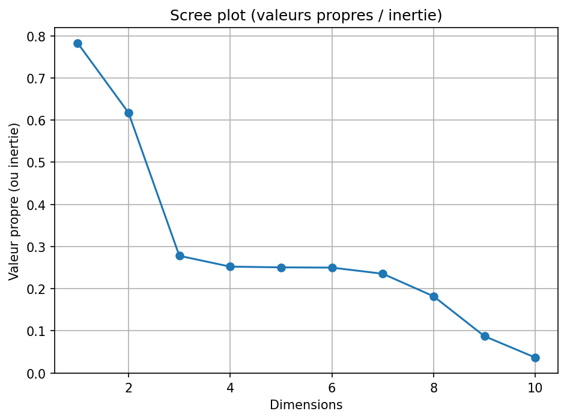

**Plan factoriel des individus.**  
Le nuage des blocs est dense autour de l’origine (profil « moyen ») avec quelques **individus atypiques** (règles de spawn particulières, combinaisons rares) qui s’éloignent surtout sur Dim2. Globalement :  

- **Dim1** ordonne les blocs du pôle « **Non** (peu conductifs, non pleins, non déplaçables / non spawnables) » vers le pôle « **Oui** » (conductifs, pleins, etc.).  
- **Dim2** isole surtout les **modalités ambiguës / rares** (p. ex. *Maybe* ou règles de spawn exceptionnelles), indiquant une hétérogénéité secondaire.  
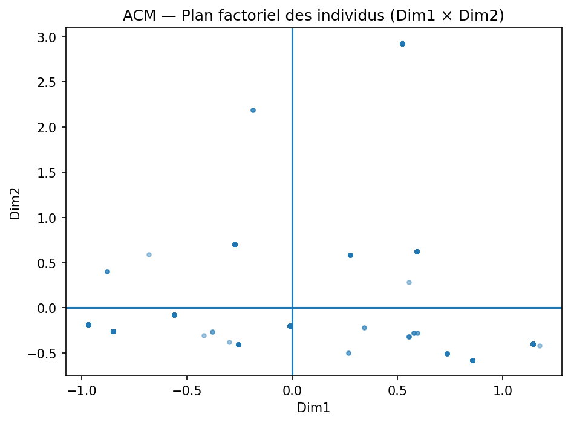

**Plan factoriel des modalités.**  
La carte des modalités confirme cette lecture :  

- Les modalités **`*_Yes`** de `conductive` et `full_cube` se **projettent du même côté de Dim1**, opposées aux **`*_No`** groupées de l’autre côté → **co-occurrence** de la « solidité/pleineur » et de la conductivité.  
- Les modalités **`*_Maybe`** (p. ex. `conductive_Maybe`, `full_cube_Maybe`, `spawnable_Maybe`) portent des coordonnées **fortes sur Dim2**, marquant leur rôle discriminant pour le second axe (cas particuliers / incertains).  
- Certaines modalités spécifiques de `spawnable` (règles restreintes) se placent près du pôle **Yes** de Dim1 mais avec une position distincte sur Dim2, suggérant qu’**être spawnable** ne signifie pas **spawnable pour tout** (nuances par type de mob).  
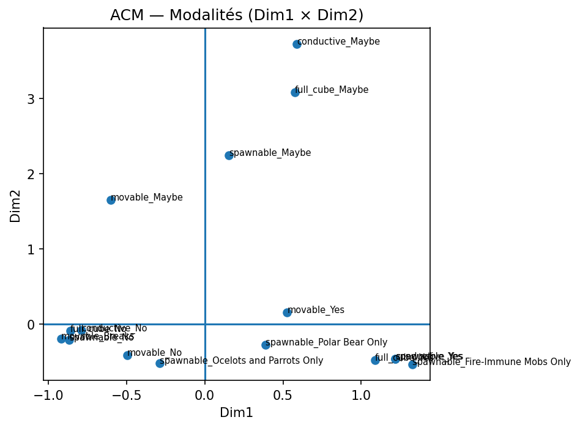

### Lecture synthétique des axes

- **Dim1 (≈ 26 %)** : gradient **« non → oui »** de propriétés structurelles (conductivité, plein, mobilité/spawn).  
- **Dim2 (≈ 20 %)** : **spécificités/ambiguïtés** (modalités *Maybe* et règles de spawn exceptionnelles).

## Clustering K-moyennes

Scripts: [src/minecraft/clustering/](https://github.com/5cover/r5.c.08-datanalyse/tree/main/src/minecraft/clustering)

### Choix de $K$

Nous choisissons $K$ en utilisant la méthode du coude:

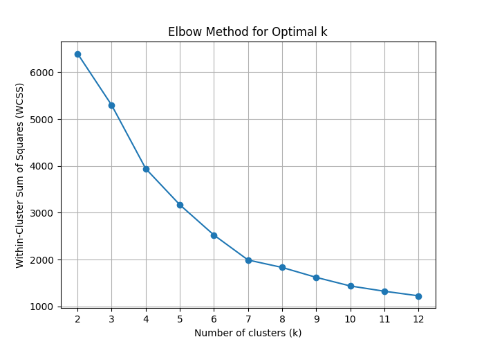
*Inertie (WCSS) par nombre de clusters*

Nous choisissons $K=7$, ce qui veux dire que nous aurons 7 clusters.

### Représentation

Nous affichons les résultats du clustering sur deux dimensions intéressantes. Ici, nous choisissons à partir des variables corrélées identifiées par l'ACP.

Du fait de la répétition de valeurs dans le jeu de données, de nombreux points sont superposés. Cela est représenté par de plus gros points. La mise à l'échelle est linéaire (5 * nombre de points superposés). Un point a une taille de 5, deux points superposé forment un point de taille 10, etc.

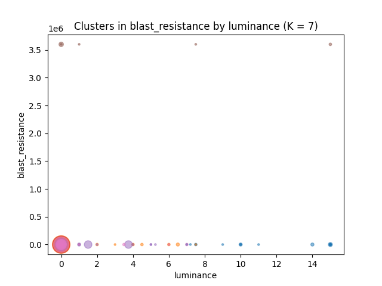
*Blast resistance par luminance*
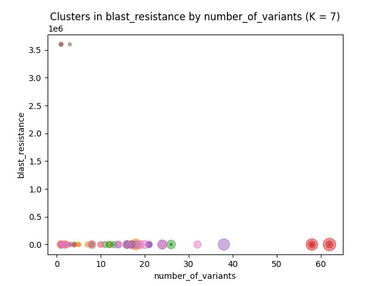
*Blast resistance par nombre de variantes*
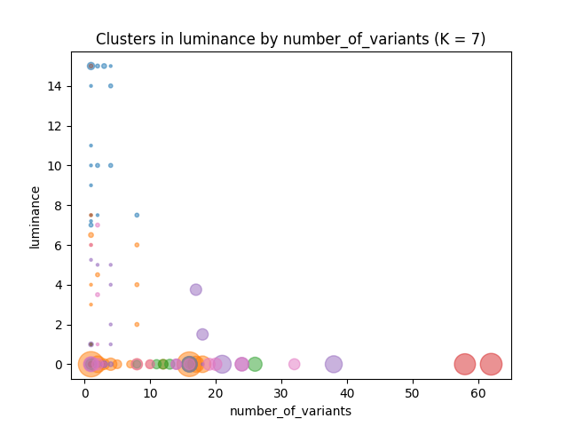
*Luminance par nombre de variantes*
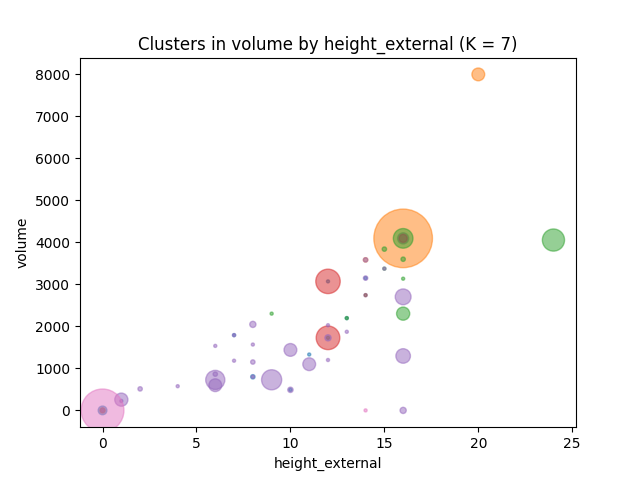
*Volume par hauteur*  
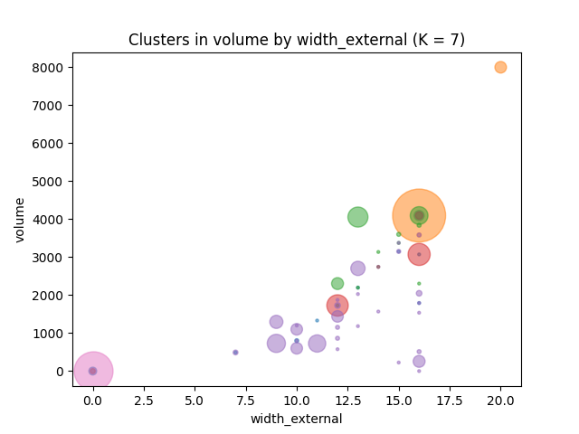
*Volume par largeur*
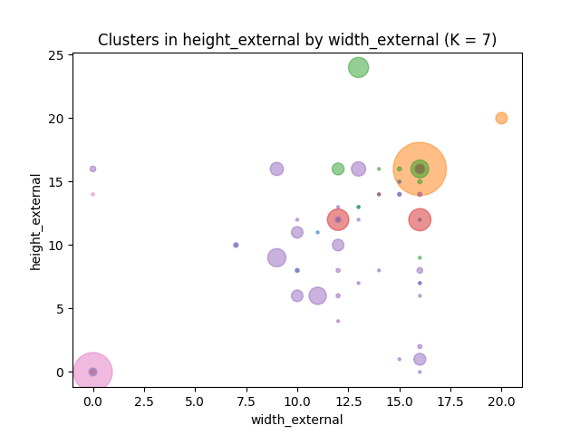
*Hauteur par largeur*

### Liste

Une regroupement des clusters et une interprétation peut être trouvée dans l'[Annexe 1: Liste clusters](#annexe-1-liste-clusters).

## Clustering hiérarchique

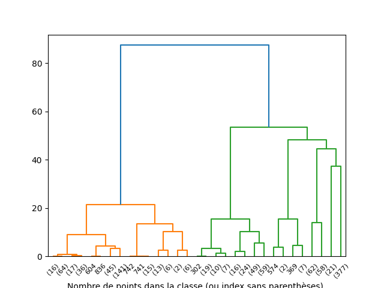
*Dendogramme avec p=4*

Ce dendogramme permet de visualiser les regroupements hiérarchiques des blocs, en utilisant la méthode de Ward. Nous avons choisi de couper l'arbre à p=4.

## Conclusion

Ce projet a permis d'explorer un jeu de données issu de Minecraft en appliquant diverses techniques d'analyse de données, notamment l'ACP, l'AFC, l'ACM et le clustering. Chaque méthode a apporté des insights uniques sur les caractéristiques des blocs du jeu, révélant des structures sous-jacentes et des relations entre les variables.

Nous avons utilisé l'IA générative (avec review) pour:

- Inteprétation intuitive des clusters déduits
- Génération de code boilerplate

## Annexe 1: Liste clusters

Cet annexe contient la liste des blocs du dataset groupés par cluster, ainsi qu'une interprétation et un nommage (par intuition) de chaque cluster.

### Cluster 1 (29 items, 2.69%): Énergie et illumination

Ce groupe rassemble presque exclusivement des blocs lumineux ou liés à la magie : torches, lanternes, portails, beacon, ancrages du Nether, etc. On y trouve aussi des éléments rares et rituels (Conduit, Enchanting Table, Respawn Anchor).

**Description :** ce cluster regroupe les objets qui produisent de la lumière, symbolisent le pouvoir ou la dimension magique du jeu. La luminosité étant une propriété peu commune, il n'est pas surprenant que l'algorithme des K-moyennes en ait réuni la plupart des blocs lumineux dans le même cluster.

- Beacon
- Campfire
- Conduit
- Copper Bulb
- Crying Obsidian
- Enchanting Table
- End Rod
- Ender Chest
- Fire
- Glowstone
- Jack o'Lantern
- Lantern
- Lava
- Lava Cauldron
- Nether Portal
- Ochre Froglight
- Pearlescent Froglight
- Respawn Anchor
- Sea Lantern
- Shroomlight
- Soul Fire
- Soul Lantern
- Soul Torch
- Soul Wall Torch
- Torch
- Vault
- Verdant Froglight
- Wall Torch
- Waxed Copper Bulb

### Cluster 2 (375 items, 34.75%): Matériaux de base et blocs pleins

C’est de loin le plus massif : pierres, minerais, bois, métaux, verres teintés, bétons, terres, et blocs utilitaires de construction. Il réunit la quasi-totalité des **blocs de structure ou de décoration compacts** du jeu.

**Description :** il s’agit clairement du **socle matériel** : tout ce qu’on mine, cuit ou polit pour construire. Un inventaire des ressources solides et “pleines” du monde.

- Acacia Log
- Acacia Planks
- Acacia Wood
- Ancient Debris
- Andesite
- Bamboo Mosaic
- Bamboo Planks
- Barrel
- Basalt
- Bee Nest
- Beehive
- Birch Log
- Birch Planks
- Birch Wood
- Black Concrete
- Black Concrete Powder
- Black Glazed Terracotta
- Black Shulker Box
- Black Terracotta
- Black Wool
- Blackstone
- Blast Furnace
- Block of Amethyst
- Block of Bamboo
- Block of Coal
- Block of Copper
- Block of Diamond
- Block of Emerald
- Block of Gold
- Block of Iron
- Block of Lapis Lazuli
- Block of Netherite
- Block of Quartz
- Block of Raw Copper
- Block of Raw Gold
- Block of Raw Iron
- Block of Redstone
- Block of Resin
- Block of Stripped Bamboo
- Blue Concrete
- Blue Concrete Powder
- Blue Glazed Terracotta
- Blue Ice
- Blue Shulker Box
- Blue Terracotta
- Blue Wool
- Bone Block
- Bookshelf
- Brain Coral Block
- Bricks
- Brown Concrete
- Brown Concrete Powder
- Brown Glazed Terracotta
- Brown Mushroom Block
- Brown Shulker Box
- Brown Terracotta
- Brown Wool
- Bubble Coral Block
- Budding Amethyst
- Calcite
- Cartography Table
- Carved Pumpkin
- Cherry Log
- Cherry Planks
- Cherry Wood
- Chiseled Bookshelf
- Chiseled Copper
- Chiseled Deepslate
- Chiseled Nether Bricks
- Chiseled Polished Blackstone
- Chiseled Quartz Block
- Chiseled Red Sandstone
- Chiseled Resin Bricks
- Chiseled Sandstone
- Chiseled Stone Bricks
- Chiseled Tuff
- Chiseled Tuff Bricks
- Clay
- Coal Ore
- Coarse Dirt
- Cobbled Deepslate
- Cobblestone
- Copper Ore
- Cracked Deepslate Bricks
- Cracked Deepslate Tiles
- Cracked Nether Bricks
- Cracked Polished Blackstone Bricks
- Cracked Stone Bricks
- Crafter
- Crafting Table
- Creaking Heart
- Crimson Hyphae
- Crimson Nylium
- Crimson Planks
- Crimson Stem
- Cut Copper
- Cut Red Sandstone
- Cut Sandstone
- Cyan Concrete
- Cyan Concrete Powder
- Cyan Glazed Terracotta
- Cyan Shulker Box
- Cyan Terracotta
- Cyan Wool
- Dark Oak Log
- Dark Oak Planks
- Dark Oak Wood
- Dark Prismarine
- Dead Brain Coral Block
- Dead Bubble Coral Block
- Dead Fire Coral Block
- Dead Horn Coral Block
- Dead Tube Coral Block
- Deepslate
- Deepslate Bricks
- Deepslate Coal Ore
- Deepslate Copper Ore
- Deepslate Diamond Ore
- Deepslate Emerald Ore
- Deepslate Gold Ore
- Deepslate Iron Ore
- Deepslate Lapis Lazuli Ore
- Deepslate Redstone Ore
- Deepslate Tiles
- Diamond Ore
- Diorite
- Dirt
- Dispenser
- Dried Kelp Block
- Dripstone Block
- Dropper
- Emerald Ore
- End Stone
- End Stone Bricks
- Exposed Chiseled Copper
- Exposed Copper
- Exposed Copper Bulb
- Exposed Cut Copper
- Fire Coral Block
- Fletching Table
- Furnace
- Gilded Blackstone
- Gold Ore
- Granite
- Grass Block
- Gravel
- Gray Concrete
- Gray Concrete Powder
- Gray Glazed Terracotta
- Gray Shulker Box
- Gray Terracotta
- Gray Wool
- Green Concrete
- Green Concrete Powder
- Green Glazed Terracotta
- Green Shulker Box
- Green Terracotta
- Green Wool
- Hay Bale
- Honeycomb Block
- Horn Coral Block
- Infested Chiseled Stone Bricks
- Infested Cobblestone
- Infested Cracked Stone Bricks
- Infested Deepslate
- Infested Mossy Stone Bricks
- Infested Stone
- Infested Stone Bricks
- Iron Ore
- Jukebox
- Jungle Log
- Jungle Planks
- Jungle Wood
- Lapis Lazuli Ore
- Light Blue Concrete
- Light Blue Concrete Powder
- Light Blue Glazed Terracotta
- Light Blue Shulker Box
- Light Blue Terracotta
- Light Blue Wool
- Light Gray Concrete
- Light Gray Concrete Powder
- Light Gray Glazed Terracotta
- Light Gray Shulker Box
- Light Gray Terracotta
- Light Gray Wool
- Lime Concrete
- Lime Concrete Powder
- Lime Glazed Terracotta
- Lime Shulker Box
- Lime Terracotta
- Lime Wool
- Lodestone
- Loom
- Magenta Concrete
- Magenta Concrete Powder
- Magenta Glazed Terracotta
- Magenta Shulker Box
- Magenta Terracotta
- Magenta Wool
- Magma Block
- Mangrove Log
- Mangrove Planks
- Mangrove Roots
- Mangrove Wood
- Melon
- Monster Spawner
- Moss Block
- Mossy Cobblestone
- Mossy Stone Bricks
- Mud
- Mud Bricks
- Muddy Mangrove Roots
- Mushroom Stem
- Mycelium
- Nether Bricks
- Nether Gold Ore
- Nether Quartz Ore
- Nether Wart Block
- Netherrack
- Note Block
- Oak Log
- Oak Planks
- Oak Wood
- Observer
- Obsidian
- Orange Concrete
- Orange Concrete Powder
- Orange Glazed Terracotta
- Orange Shulker Box
- Orange Terracotta
- Orange Wool
- Oxidized Chiseled Copper
- Oxidized Copper
- Oxidized Copper Bulb
- Oxidized Cut Copper
- Packed Ice
- Packed Mud
- Pale Moss Block
- Pale Oak Log
- Pale Oak Planks
- Pale Oak Wood
- Pink Concrete
- Pink Concrete Powder
- Pink Glazed Terracotta
- Pink Shulker Box
- Pink Terracotta
- Pink Wool
- Podzol
- Polished Andesite
- Polished Basalt
- Polished Blackstone
- Polished Blackstone Bricks
- Polished Deepslate
- Polished Diorite
- Polished Granite
- Polished Tuff
- Prismarine
- Prismarine Bricks
- Pumpkin
- Purple Concrete
- Purple Concrete Powder
- Purple Glazed Terracotta
- Purple Shulker Box
- Purple Terracotta
- Purple Wool
- Purpur Block
- Purpur Pillar
- Quartz Bricks
- Quartz Pillar
- Red Concrete
- Red Concrete Powder
- Red Glazed Terracotta
- Red Mushroom Block
- Red Nether Bricks
- Red Sand
- Red Sandstone
- Red Shulker Box
- Red Terracotta
- Red Wool
- Redstone Lamp
- Redstone Ore
- Reinforced Deepslate
- Resin Bricks
- Rooted Dirt
- Sand
- Sandstone
- Sculk
- Sculk Catalyst
- Shulker Box
- Slime Block
- Smithing Table
- Smoker
- Smooth Basalt
- Smooth Quartz Block
- Smooth Red Sandstone
- Smooth Sandstone
- Smooth Stone
- Snow Block
- Soul Sand
- Soul Soil
- Sponge
- Spruce Log
- Spruce Planks
- Spruce Wood
- Stone
- Stone Bricks
- Stripped Acacia Log
- Stripped Acacia Wood
- Stripped Birch Log
- Stripped Birch Wood
- Stripped Cherry Log
- Stripped Cherry Wood
- Stripped Crimson Hyphae
- Stripped Crimson Stem
- Stripped Dark Oak Log
- Stripped Dark Oak Wood
- Stripped Jungle Log
- Stripped Jungle Wood
- Stripped Mangrove Log
- Stripped Mangrove Wood
- Stripped Oak Log
- Stripped Oak Wood
- Stripped Pale Oak Log
- Stripped Pale Oak Wood
- Stripped Spruce Log
- Stripped Spruce Wood
- Stripped Warped Hyphae
- Stripped Warped Stem
- Suspicious Gravel
- Suspicious Sand
- TNT
- Target
- Terracotta
- Trial Spawner
- Tube Coral Block
- Tuff
- Tuff Bricks
- Warped Hyphae
- Warped Nylium
- Warped Planks
- Warped Stem
- Warped Wart Block
- Waxed Block of Copper
- Waxed Chiseled Copper
- Waxed Cut Copper
- Waxed Exposed Chiseled Copper
- Waxed Exposed Copper
- Waxed Exposed Copper Bulb
- Waxed Exposed Cut Copper
- Waxed Oxidized Chiseled Copper
- Waxed Oxidized Copper
- Waxed Oxidized Copper Bulb
- Waxed Oxidized Cut Copper
- Waxed Weathered Chiseled Copper
- Waxed Weathered Copper
- Waxed Weathered Copper Bulb
- Waxed Weathered Cut Copper
- Weathered Chiseled Copper
- Weathered Copper
- Weathered Copper Bulb
- Weathered Cut Copper
- Wet Sponge
- White Concrete
- White Concrete Powder
- White Glazed Terracotta
- White Shulker Box
- White Terracotta
- White Wool
- Yellow Concrete
- Yellow Concrete Powder
- Yellow Glazed Terracotta
- Yellow Shulker Box
- Yellow Terracotta
- Yellow Wool

### Cluster 3 (118 items, 10.94%): Transparence, clôtures et limites

Ce groupe combine les vitres, les glaces, les feuilles, les grilles et les clôtures, mais aussi les murs et barrières décoratives.

**Description :** un ensemble orienté sur la **délimitation visuelle et la transparence**. Les blocs y sont semi-perméables, décoratifs ou protecteurs, souvent employés pour séparer sans enfermer. Il n'est pas étonant que les blocs non-pleins (Fences, Walls...) et transparents (Glass) se retrouvent dans le même cluster: ils sont tous les deux non conducteurs (`conductive`=0).

- Acacia Fence
- Acacia Fence Gate
- Acacia Leaves
- Andesite Wall
- Azalea Leaves
- Bamboo Fence
- Bamboo Fence Gate
- Birch Fence
- Birch Fence Gate
- Birch Leaves
- Black Stained Glass
- Black Stained Glass Pane
- Blackstone Wall
- Blue Stained Glass
- Blue Stained Glass Pane
- Brick Wall
- Brown Stained Glass
- Brown Stained Glass Pane
- Chain
- Cherry Fence
- Cherry Fence Gate
- Cherry Leaves
- Chorus Flower
- Cobbled Deepslate Wall
- Cobblestone Wall
- Copper Grate
- Crimson Fence
- Crimson Fence Gate
- Cyan Stained Glass
- Cyan Stained Glass Pane
- Dark Oak Fence
- Dark Oak Fence Gate
- Dark Oak Leaves
- Decorated Pot
- Deepslate Brick Wall
- Deepslate Tile Wall
- Diorite Wall
- Dirt Path
- Dragon Egg
- End Stone Brick Wall
- Exposed Copper Grate
- Farmland
- Flowering Azalea Leaves
- Frosted Ice
- Glass
- Glass Pane
- Granite Wall
- Gray Stained Glass
- Gray Stained Glass Pane
- Green Stained Glass
- Green Stained Glass Pane
- Honey Block
- Ice
- Iron Bars
- Jungle Fence
- Jungle Fence Gate
- Jungle Leaves
- Light Blue Stained Glass
- Light Blue Stained Glass Pane
- Light Gray Stained Glass
- Light Gray Stained Glass Pane
- Lightning Rod
- Lime Stained Glass
- Lime Stained Glass Pane
- Magenta Stained Glass
- Magenta Stained Glass Pane
- Mangrove Fence
- Mangrove Fence Gate
- Mangrove Leaves
- Mossy Cobblestone Wall
- Mossy Stone Brick Wall
- Mud Brick Wall
- Nether Brick Fence
- Nether Brick Wall
- Oak Fence
- Oak Fence Gate
- Oak Leaves
- Orange Stained Glass
- Orange Stained Glass Pane
- Oxidized Copper Grate
- Pale Oak Fence
- Pale Oak Fence Gate
- Pale Oak Leaves
- Pink Stained Glass
- Pink Stained Glass Pane
- Polished Blackstone Brick Wall
- Polished Blackstone Wall
- Polished Deepslate Wall
- Polished Tuff Wall
- Prismarine Wall
- Purple Stained Glass
- Purple Stained Glass Pane
- Red Nether Brick Wall
- Red Sandstone Wall
- Red Stained Glass
- Red Stained Glass Pane
- Resin Brick Wall
- Sandstone Wall
- Sniffer Egg
- Spruce Fence
- Spruce Fence Gate
- Spruce Leaves
- Stone Brick Wall
- Stonecutter
- Tinted Glass
- Tuff Brick Wall
- Tuff Wall
- Warped Fence
- Warped Fence Gate
- Waxed Copper Grate
- Waxed Exposed Copper Grate
- Waxed Oxidized Copper Grate
- Waxed Weathered Copper Grate
- Weathered Copper Grate
- White Stained Glass
- White Stained Glass Pane
- Yellow Stained Glass
- Yellow Stained Glass Pane

### Cluster 4 (120 items, 11.12%): Formes dérivées : escaliers et dalles

Tous les blocs ici sont des variantes “géométriques” de matériaux du cluster 2 : dalles, escaliers, et leurs versions oxydées ou cirées.

**Description :** le **volet architectural**, centré sur les déclinaisons fonctionnelles des matériaux de base pour sculpter et affiner les constructions.

- Acacia Slab
- Acacia Stairs
- Andesite Slab
- Andesite Stairs
- Bamboo Mosaic Slab
- Bamboo Mosaic Stairs
- Bamboo Slab
- Bamboo Stairs
- Birch Slab
- Birch Stairs
- Blackstone Slab
- Blackstone Stairs
- Brick Slab
- Brick Stairs
- Cherry Slab
- Cherry Stairs
- Cobbled Deepslate Slab
- Cobbled Deepslate Stairs
- Cobblestone Slab
- Cobblestone Stairs
- Crimson Slab
- Crimson Stairs
- Cut Copper Slab
- Cut Copper Stairs
- Cut Red Sandstone Slab
- Cut Sandstone Slab
- Dark Oak Slab
- Dark Oak Stairs
- Dark Prismarine Slab
- Dark Prismarine Stairs
- Deepslate Brick Slab
- Deepslate Brick Stairs
- Deepslate Tile Slab
- Deepslate Tile Stairs
- Diorite Slab
- Diorite Stairs
- End Stone Brick Slab
- End Stone Brick Stairs
- Exposed Cut Copper Slab
- Exposed Cut Copper Stairs
- Granite Slab
- Granite Stairs
- Jungle Slab
- Jungle Stairs
- Mangrove Slab
- Mangrove Stairs
- Mossy Cobblestone Slab
- Mossy Cobblestone Stairs
- Mossy Stone Brick Slab
- Mossy Stone Brick Stairs
- Mud Brick Slab
- Mud Brick Stairs
- Nether Brick Slab
- Nether Brick Stairs
- Oak Slab
- Oak Stairs
- Oxidized Cut Copper Slab
- Oxidized Cut Copper Stairs
- Pale Oak Slab
- Pale Oak Stairs
- Petrified Oak Slab
- Polished Andesite Slab
- Polished Andesite Stairs
- Polished Blackstone Brick Slab
- Polished Blackstone Brick Stairs
- Polished Blackstone Slab
- Polished Blackstone Stairs
- Polished Deepslate Slab
- Polished Deepslate Stairs
- Polished Diorite Slab
- Polished Diorite Stairs
- Polished Granite Slab
- Polished Granite Stairs
- Polished Tuff Slab
- Polished Tuff Stairs
- Prismarine Brick Slab
- Prismarine Brick Stairs
- Prismarine Slab
- Prismarine Stairs
- Purpur Slab
- Purpur Stairs
- Quartz Slab
- Quartz Stairs
- Red Nether Brick Slab
- Red Nether Brick Stairs
- Red Sandstone Slab
- Red Sandstone Stairs
- Resin Brick Slab
- Resin Brick Stairs
- Sandstone Slab
- Sandstone Stairs
- Smooth Quartz Slab
- Smooth Quartz Stairs
- Smooth Red Sandstone Slab
- Smooth Red Sandstone Stairs
- Smooth Sandstone Slab
- Smooth Sandstone Stairs
- Smooth Stone Slab
- Spruce Slab
- Spruce Stairs
- Stone Brick Slab
- Stone Brick Stairs
- Stone Slab
- Stone Stairs
- Tuff Brick Slab
- Tuff Brick Stairs
- Tuff Slab
- Tuff Stairs
- Warped Slab
- Warped Stairs
- Waxed Cut Copper Slab
- Waxed Cut Copper Stairs
- Waxed Exposed Cut Copper Slab
- Waxed Exposed Cut Copper Stairs
- Waxed Oxidized Cut Copper Slab
- Waxed Oxidized Cut Copper Stairs
- Waxed Weathered Cut Copper Slab
- Waxed Weathered Cut Copper Stairs
- Weathered Cut Copper Slab
- Weathered Cut Copper Stairs

### Cluster 5 (235 items, 21.78%): Objets interactifs et décorations fines

Mélange de blocs fonctionnels (portes, trappes, pistons, comparateurs) et d’éléments esthétiques (bougies, têtes, fleurs en pot, lits, tapis, chandeliers).

**Description :** le **registre de l’habitat** : tout ce qui anime ou personnalise un intérieur, entre technologie redstone simple, mobilier et végétation d’ornement.

- Acacia Door
- Acacia Hanging Sign
- Acacia Trapdoor
- Acacia Wall Hanging Sign
- Amethyst ## Cluster
- Anvil
- Azalea
- Bamboo
- Bamboo Door
- Bamboo Hanging Sign
- Bamboo Shoot
- Bamboo Trapdoor
- Bamboo Wall Hanging Sign
- Bell
- Big Dripleaf
- Big Dripleaf Stem
- Birch Door
- Birch Hanging Sign
- Birch Trapdoor
- Birch Wall Hanging Sign
- Black Bed
- Black Candle
- Black Carpet
- Blue Bed
- Blue Candle
- Blue Carpet
- Brewing Stand
- Brown Bed
- Brown Candle
- Brown Carpet
- Cactus
- Cake
- Cake with Black Candle
- Cake with Blue Candle
- Cake with Brown Candle
- Cake with Candle
- Cake with Cyan Candle
- Cake with Gray Candle
- Cake with Green Candle
- Cake with Light Blue Candle
- Cake with Light Gray Candle
- Cake with Lime Candle
- Cake with Magenta Candle
- Cake with Orange Candle
- Cake with Pink Candle
- Cake with Purple Candle
- Cake with Red Candle
- Cake with White Candle
- Cake with Yellow Candle
- Calibrated Sculk Sensor
- Candle
- Cauldron
- Cherry Door
- Cherry Hanging Sign
- Cherry Trapdoor
- Cherry Wall Hanging Sign
- Chest
- Chipped Anvil
- Chorus Plant
- Cocoa
- Composter
- Copper Door
- Copper Trapdoor
- Creeper Head
- Creeper Wall Head
- Crimson Door
- Crimson Hanging Sign
- Crimson Trapdoor
- Crimson Wall Hanging Sign
- Cyan Bed
- Cyan Candle
- Cyan Carpet
- Damaged Anvil
- Dark Oak Door
- Dark Oak Hanging Sign
- Dark Oak Trapdoor
- Dark Oak Wall Hanging Sign
- Daylight Detector
- Dragon Head
- Dragon Wall Head
- Exposed Copper Door
- Exposed Copper Trapdoor
- Flower Pot
- Flowering Azalea
- Gray Bed
- Gray Candle
- Gray Carpet
- Green Bed
- Green Candle
- Green Carpet
- Grindstone
- Heavy Core
- Hopper
- Iron Door
- Iron Trapdoor
- Jungle Door
- Jungle Hanging Sign
- Jungle Trapdoor
- Jungle Wall Hanging Sign
- Ladder
- Large Amethyst Bud
- Lectern
- Light Blue Bed
- Light Blue Candle
- Light Blue Carpet
- Light Gray Bed
- Light Gray Candle
- Light Gray Carpet
- Lily Pad
- Lime Bed
- Lime Candle
- Lime Carpet
- Magenta Bed
- Magenta Candle
- Magenta Carpet
- Mangrove Door
- Mangrove Hanging Sign
- Mangrove Trapdoor
- Mangrove Wall Hanging Sign
- Medium Amethyst Bud
- Moss Carpet
- Oak Door
- Oak Hanging Sign
- Oak Trapdoor
- Oak Wall Hanging Sign
- Orange Bed
- Orange Candle
- Orange Carpet
- Oxidized Copper Door
- Oxidized Copper Trapdoor
- Pale Hanging Moss
- Pale Moss Carpet
- Pale Oak Door
- Pale Oak Hanging Sign
- Pale Oak Trapdoor
- Pale Oak Wall Hanging Sign
- Piglin Head
- Piglin Wall Head
- Pink Bed
- Pink Candle
- Pink Carpet
- Piston
- Piston Head
- Pitcher Crop
- Player Head
- Player Wall Head
- Potted Acacia Sapling
- Potted Allium
- Potted Azalea
- Potted Azure Bluet
- Potted Bamboo
- Potted Birch Sapling
- Potted Blue Orchid
- Potted Brown Mushroom
- Potted Cactus
- Potted Cherry Sapling
- Potted Closed Eyeblossom
- Potted Cornflower
- Potted Crimson Fungus
- Potted Crimson Roots
- Potted Dandelion
- Potted Dark Oak Sapling
- Potted Dead Bush
- Potted Fern
- Potted Flowering Azalea
- Potted Jungle Sapling
- Potted Lily of the Valley
- Potted Mangrove Propagule
- Potted Oak Sapling
- Potted Open Eyeblossom
- Potted Orange Tulip
- Potted Oxeye Daisy
- Potted Pale Oak Sapling
- Potted Pink Tulip
- Potted Poppy
- Potted Red Mushroom
- Potted Red Tulip
- Potted Spruce Sapling
- Potted Torchflower
- Potted Warped Fungus
- Potted Warped Roots
- Potted White Tulip
- Potted Wither Rose
- Powder Snow
- Powder Snow Cauldron
- Purple Bed
- Purple Candle
- Purple Carpet
- Red Bed
- Red Candle
- Red Carpet
- Redstone Comparator
- Redstone Repeater
- Resin Clump
- Scaffolding
- Sculk Sensor
- Sculk Shrieker
- Sea Pickle
- Skeleton Skull
- Skeleton Wall Skull
- Small Amethyst Bud
- Snow
- Soul Campfire
- Spruce Door
- Spruce Hanging Sign
- Spruce Trapdoor
- Spruce Wall Hanging Sign
- Sticky Piston
- Trapped Chest
- Turtle Egg
- Warped Door
- Warped Hanging Sign
- Warped Trapdoor
- Warped Wall Hanging Sign
- Water Cauldron
- Waxed Copper Door
- Waxed Copper Trapdoor
- Waxed Exposed Copper Door
- Waxed Exposed Copper Trapdoor
- Waxed Oxidized Copper Door
- Waxed Oxidized Copper Trapdoor
- Waxed Weathered Copper Door
- Waxed Weathered Copper Trapdoor
- Weathered Copper Door
- Weathered Copper Trapdoor
- White Bed
- White Candle
- White Carpet
- Wither Skeleton Skull
- Wither Skeleton Wall Skull
- Yellow Bed
- Yellow Candle
- Yellow Carpet
- Zombie Head
- Zombie Wall Head

### Cluster 6 (11 items, 1.02%): Blocs de contrôle et techniques réservées aux opérateurs

On n’y trouve que des blocs inaccessibles en survie : Command Blocks, Structure Block, End Portal Frame, Light Block, Bedrock, etc.

**Description :** le **noyau administratif et technique**, regroupant les outils de commande, de génération ou de structure du moteur du jeu.

- Barrier
- Bedrock
- Chain Command Block
- Command Block
- End Gateway
- End Portal
- End Portal Frame
- Jigsaw Block
- Light
- Repeating Command Block
- Structure Block

### Cluster 7 (191 items, 17.70%): Végétation, signaux et entités vivantes

Riche en plantes, pousses, champignons, coraux, bannières et plaques de pression, ce cluster mêle éléments naturels et blocs sensibles (rails, redstone wire, tripwire).

**Description :** le **monde vivant et réactif** : tout ce qui pousse, capte ou signale. Il combine flore, éléments organiques et dispositifs légers du gameplay.

- Acacia Button
- Acacia Pressure Plate
- Acacia Sapling
- Acacia Sign
- Acacia Wall Sign
- Activator Rail
- Air
- Allium
- Attached Melon Stem
- Attached Pumpkin Stem
- Azure Bluet
- Bamboo Button
- Bamboo Pressure Plate
- Bamboo Sign
- Bamboo Wall Sign
- Beetroots
- Birch Button
- Birch Pressure Plate
- Birch Sapling
- Birch Sign
- Birch Wall Sign
- Black Banner
- Blue Banner
- Blue Orchid
- Brain Coral
- Brain Coral Fan
- Brain Coral Wall Fan
- Brown Banner
- Brown Mushroom
- Bubble Column
- Bubble Coral
- Bubble Coral Fan
- Bubble Coral Wall Fan
- Carrots
- Cave Air
- Cave Vines
- Cave Vines Plant
- Cherry Button
- Cherry Pressure Plate
- Cherry Sapling
- Cherry Sign
- Cherry Wall Sign
- Closed Eyeblossom
- Cobweb
- Cornflower
- Crimson Button
- Crimson Fungus
- Crimson Pressure Plate
- Crimson Roots
- Crimson Sign
- Crimson Wall Sign
- Cyan Banner
- Dandelion
- Dark Oak Button
- Dark Oak Pressure Plate
- Dark Oak Sapling
- Dark Oak Sign
- Dark Oak Wall Sign
- Dead Brain Coral
- Dead Brain Coral Fan
- Dead Brain Coral Wall Fan
- Dead Bubble Coral
- Dead Bubble Coral Fan
- Dead Bubble Coral Wall Fan
- Dead Bush
- Dead Fire Coral
- Dead Fire Coral Fan
- Dead Fire Coral Wall Fan
- Dead Horn Coral
- Dead Horn Coral Fan
- Dead Horn Coral Wall Fan
- Dead Tube Coral
- Dead Tube Coral Fan
- Dead Tube Coral Wall Fan
- Detector Rail
- Fern
- Fire Coral
- Fire Coral Fan
- Fire Coral Wall Fan
- Frogspawn
- Glow Lichen
- Gray Banner
- Green Banner
- Hanging Roots
- Heavy Weighted Pressure Plate
- Horn Coral
- Horn Coral Fan
- Horn Coral Wall Fan
- Jungle Button
- Jungle Pressure Plate
- Jungle Sapling
- Jungle Sign
- Jungle Wall Sign
- Kelp
- Kelp Plant
- Large Fern
- Lever
- Light Blue Banner
- Light Gray Banner
- Light Weighted Pressure Plate
- Lilac
- Lily of the Valley
- Lime Banner
- Magenta Banner
- Mangrove Button
- Mangrove Pressure Plate
- Mangrove Propagule
- Mangrove Sign
- Mangrove Wall Sign
- Melon Stem
- Moving Piston
- Nether Sprouts
- Nether Wart
- Oak Button
- Oak Pressure Plate
- Oak Sapling
- Oak Sign
- Oak Wall Sign
- Open Eyeblossom
- Orange Banner
- Orange Tulip
- Oxeye Daisy
- Pale Oak Button
- Pale Oak Pressure Plate
- Pale Oak Sapling
- Pale Oak Sign
- Pale Oak Wall Sign
- Peony
- Pink Banner
- Pink Petals
- Pink Tulip
- Pitcher Plant
- Pointed Dripstone
- Polished Blackstone Button
- Polished Blackstone Pressure Plate
- Poppy
- Potatoes
- Powered Rail
- Pumpkin Stem
- Purple Banner
- Rail
- Red Banner
- Red Mushroom
- Red Tulip
- Redstone Torch
- Redstone Wall Torch
- Redstone Wire
- Rose Bush
- Sculk Vein
- Seagrass
- Short Grass
- Small Dripleaf
- Spore Blossom
- Spruce Button
- Spruce Pressure Plate
- Spruce Sapling
- Spruce Sign
- Spruce Wall Sign
- Stone Button
- Stone Pressure Plate
- Structure Void
- Sugar Cane
- Sunflower
- Sweet Berry Bush
- Tall Grass
- Tall Seagrass
- Torchflower
- Torchflower Crop
- Tripwire
- Tripwire Hook
- Tube Coral
- Tube Coral Fan
- Tube Coral Wall Fan
- Twisting Vines
- Twisting Vines Plant
- Vines
- Void Air
- Warped Button
- Warped Fungus
- Warped Pressure Plate
- Warped Roots
- Warped Sign
- Warped Wall Sign
- Water
- Weeping Vines
- Weeping Vines Plant
- Wheat Crops
- White Banner
- White Tulip
- Wither Rose
- Yellow Banner
